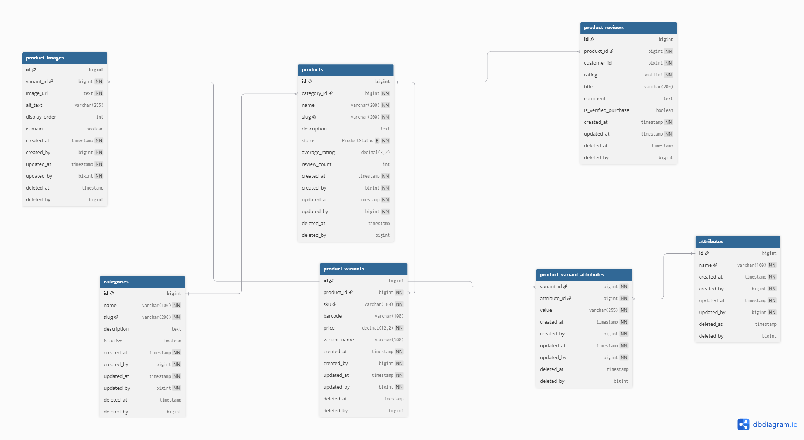

# Catalog Module

## Overview

The Catalog module is the core of the e-commerce system, responsible for managing the product catalog and all related data. It handles categories, products, product variants, attributes, images, and customer reviews, providing the foundation for product discovery and management.

The module enables:

- **Guests** to browse products, search the catalog, filter products by different criteria, and view detailed product information.
- **Customers** to submit and manage product reviews for purchased products.
- **Administrators** to create, update, archive, and manage categories, products, variants, images, and other catalog-related data.

By centralizing all catalog operations, this module serves as the primary source of product information consumed by other modules such as Inventory, Orders, Cart, and Wishlist.


---

# Database Design

The following ERD illustrates the database structure of the Catalog module and the relationships between its entities.

<p align="center">
    
</p>

---

# API Design

The Catalog module exposes RESTful APIs for managing and browsing the product catalog. Public endpoints allow guests to discover products, while protected endpoints enable customers and administrators to perform their respective operations.


# Categories

| Method | Endpoint | Access | Description |
|--------|----------|--------|-------------|
| GET | `/categories` | Guest | Browse all categories |
| GET | `/categories/{id}` | Guest | View category details |
| POST | `/categories` | Admin | Create a new category |
| PUT | `/categories/{id}` | Admin | Update a category |
| PATCH | `/categories/{id}/archive` | Admin | Archive a category |

---

# Products

| Method | Endpoint | Access | Description |
|--------|----------|--------|-------------|
| GET | `/products` | Guest | Browse products (supports search, filtering, sorting and pagination) |
| GET | `/products/{slug}` | Guest | View product details |
| POST | `/products` | Admin | Create a new product |
| PUT | `/products/{id}` | Admin | Update a product |
| PATCH | `/products/{id}/archive` | Admin | Archive a product |

### Supported Query Parameters

| Parameter | Description | Example |
|-----------|-------------|---------|
| search | Search by keyword | `?search=laptop` |
| category | Filter by category | `?category=laptops` |
| minPrice | Minimum price | `?minPrice=500` |
| maxPrice | Maximum price | `?maxPrice=5000` |
| minRating | Minimum rating | `?minRating=4` |
| sortBy | Sort field | `?sortBy=price` |
| direction | ASC / DESC | `?direction=ASC` |
| page | Page number | `?page=0` |
| size | Items per page | `?size=20` |

Example:

```http
GET /products?search=logitech&category=mouse&minPrice=500&maxPrice=3000&sortBy=price&direction=ASC&page=0&size=20
```

---

# Product Reviews

| Method | Endpoint | Access | Description |
|--------|----------|--------|-------------|
| POST | `/products/{id}/reviews` | Customer | Add a review |
| PUT | `/reviews/{id}` | Customer | Update own review |
| DELETE | `/reviews/{id}` | Customer | Delete own review |

---
## Response Codes

| Code | Meaning |
|------|---------|
| 200 | Success |
| 201 | Created |
| 204 | No Content |
| 400 | Validation Error |
| 401 | Unauthorized |
| 403 | Forbidden |
| 404 | Resource Not Found |
| 409 | Conflict |
| 500 | Internal Server Error |
